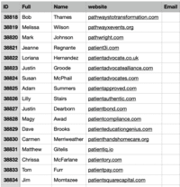

# Email Extractor Chrome Extension


## Features

- Automates Name2Email manually adding leads

## Screenshots




## Run Locally

Clone the project

```bash
  git clone https://github.com/Abdullahjaffer/email-extractor-chrome-extension.git
```

Go to the project directory

```bash
  cd my-project
```

Install dependencies

```bash
  npm install
```

Start the extension for development

```bash
  npm run start
```

Build the extension

```bash
  npm run build
```

## Usage

- Used with gmail opened and logged in.
- Name2Email extension should be installed

Need to upload a csv with following columns:

- ID
- Full
- Name
- website
- Email

_(All are Case Sensitive)_

**Stop script before downloading**

## Roadmap

- Remove the need for Name2Email

## 🔗 Links

[](https://www.linkedin.com/)

## LICENSEs

[](https://github.com/tterb/atomic-design-ui/blob/master/LICENSEs)
[](https://opensource.org/licenses/)
[](http://www.gnu.org/licenses/agpl-3.0)
